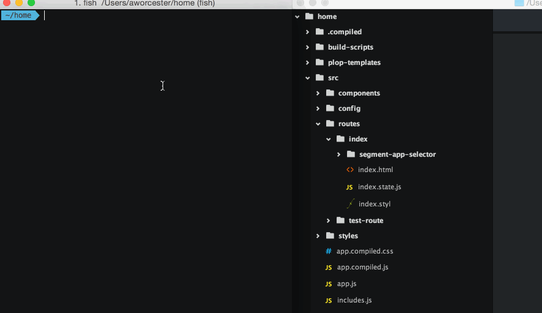

<h1 align="center">Modern js tooling for repeat template</h1>

> This template should help quick control/create a duplicate/repeat layout or template (Avoid boring of just copy and paste).. Questions, feedback, and for now, even bikeshedding are welcome.



## Getting started

Use command for generate, you can change everyfile you need, just customize like what `layout/structure`` you like! Enjoy it! 
```
Yarn gen
```
<details>
<summary>💡 Hint</summary><br><b>

> This example for this structure:

```
├── public/
└── src /
    ├── containers/
        ├── YourFeatures/
            ├── index
            ├── FeatureContainer
            ├── reducer
            ├── Saga
            ├── Loading
            ├── Services
            ├── style
```

</details>

```
cd auto-generate-files-repeat/
yarn
yarn dev
```
